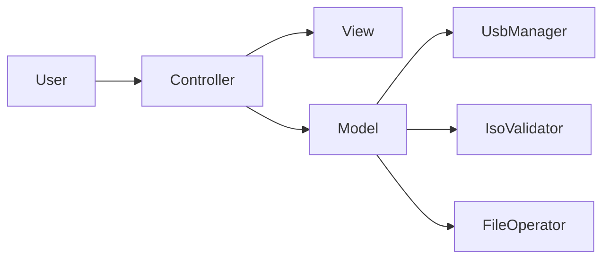

<h1 align="center">pyburn</h1>

<p align="center">
  <strong>
    Open-source Linux USB tool — format drives, burn bootable ISOs, skip the Rufus reboot.
  </strong>
</p>

<p align="center">
  
</p>

<p align="center">
  <code>██████╗ ██╗   ██╗██████╗ ██╗   ██╗██████╗ ███╗   ██╗</code><br>
  <code>██╔══██╗╚██╗ ██╔╝██╔══██╗██║   ██║██╔══██╗████╗  ██║</code><br>
  <code>██████╔╝ ╚████╔╝ ██████╔╝██║   ██║██████╔╝██╔██╗ ██║</code><br>
  <code>██╔═══╝   ╚██╔╝  ██╔══██╗██║   ██║██╔══██╗██║╚██╗██║</code><br>
  <code>██║        ██║   ██████╔╝╚██████╔╝██║  ██║██║ ╚████║</code><br>
  <code>╚═╝        ╚═╝   ╚═════╝  ╚═════╝ ╚═╝  ╚═╝╚═╝  ╚═══╝</code>
</p>

<p align="center">
  <a href="LICENSE"></a>
  <a href="https://www.python.org/downloads/"></a>
  
  
</p>

<p align="center">
  <a href="#-what-is-pyburn">About</a> ·
  <a href="#-features">Features</a> ·
  <a href="#-quick-start">Quick Start</a> ·
  <a href="#-format-a-usb-drive-for-storage-tui-menu">Format USB</a> ·
  <a href="#-create-a-bootable-linux-or-windows-usb">Burn ISO</a> ·
  <a href="#-how-iso-burning-works">How ISO Burning Works</a> ·
  <a href="#-open-source--mit-license">License</a> ·
  <a href="#-faq">FAQ</a>
</p>

---

## 🔥 What is pyburn?

**pyburn** (`py_burn`) is a free, **open-source**, **MIT-licensed** Python app for Linux that helps you:

- **Format USB drives** as empty FAT32 storage
- **Create bootable USB sticks** from Linux and Windows ISO files
- **Download official ISOs** without hunting mirror pages
- **Replace Rufus** when you live on Linux and do not want a Windows VM just to flash a stick

No mystery binaries. No vendor lock-in. Fork it, read it, improve it — that is the point.

> **TL;DR:** Plug USB → pick mode → confirm → done. Your future self thanks you.

---

## ✨ Features

| What you need | What pyburn does |
|---|---|
| **Rufus alternative on Linux** | GUI, CLI, and Rich terminal menu for USB workflows |
| **Format USB to FAT32** | Wipe, partition, and label a blank storage drive |
| **Bootable Linux USB** | Validate ISO, prepare partition, copy live/installer files |
| **Bootable Windows USB** | Handles large `install.wim` splits for FAT32 limits |
| **ISO downloader** | Curated catalog: Arch, Ubuntu, Fedora, Debian, and more |
| **Dependency checker** | Tells you exactly which packages your distro is missing |
| **Safety first** | Confirmations, incomplete-field checks, device warnings |

**Interfaces:**

| Command | Mode | Best for |
|---|---|---|
| `sudo poetry run py_burn -tui` | **Menu (TUI)** | Guided FAT32 storage formatting |
| `sudo poetry run py_burn` | **GUI** | Visual bootable ISO creation |
| `poetry run py_burn -cli` | **CLI** | Quick status and scripting |
| `poetry run py_burn -download <os>` | **CLI** | Fetch official ISO images |
| `poetry run py_burn -list-usb` | **CLI** | List removable USB devices |

---

## 🚀 Quick Start

### Install

```bash
git clone https://github.com/tuliofh01/py_burn.git
cd py_burn
poetry install          # creates .venv and installs dependencies
poetry run py_burn -check-deps
```

### Project layout (max depth: 4)

```text
py_burn/
├── pyburn.py           # launcher script
├── pyproject.toml      # Poetry project config
├── poetry.lock
├── poetry.toml
├── .gitignore
├── LICENSE
├── README.md
├── .venv/              # local Python environment
├── py_burn/            # application package
│   ├── __main__.py
│   ├── model/
│   ├── view/
│   ├── controller/
│   └── data/
└── tests/
```

### Try it in 30 seconds

```bash
# See your USB drives
poetry run py_burn -list-usb
# or
poetry run python pyburn.py -list-usb

# Launch the terminal menu (storage formatting)
sudo poetry run py_burn -tui

# Or burn an ISO with the GUI
sudo poetry run py_burn
```

> Destructive steps need `sudo`. When in doubt, `-list-usb` first. Trust, but verify `/dev/sdX`.

---

## 💾 Format a USB drive for storage (TUI menu)

**Use case:** blank thumb drive for files — not a bootable installer.

```bash
sudo poetry run py_burn -tui
```

1. **USB Device** → pick your drive from the list (or type `/dev/sdX`)
2. **Format Options** → `vfat` / `gpt` / volume label (defaults are fine)
3. **Actions** → set safety confirmation to `yes`
4. Main menu → **Format USB storage** → read the warning → confirm

You get a single empty **FAT32** partition. No ISO. No bootloader drama. Just storage.

---

## 💿 Create a bootable Linux or Windows USB

**Use case:** install Ubuntu, Arch, Fedora, Windows 10/11, or any supported ISO.

### Step 1 — Prepare (CLI)

```bash
poetry run py_burn -check-deps
poetry run py_burn -list-usb
poetry run py_burn -download ubuntu   # optional — built-in catalog
```

Downloads land in `~/Downloads/py_burn/` by default.

### Step 2 — Burn (GUI)

```bash
sudo poetry run py_burn
```

1. Select your **ISO file**
2. Choose the **USB device**
3. Review warnings
4. Click **Burn to USB**

### What happens behind the scenes

```text
ISO  →  validate  →  wipe USB  →  partition  →  FAT32  →  copy files  →  verify boot files
```

Windows images get **WIM splitting** when files exceed FAT32 size limits. Linux live ISOs copy straight through. You get the boring reliability without the boring terminal archaeology.

---

## 📚 How ISO burning works

Before you flash a stick, it helps to know what you are actually making. This is the stuff Rufus never explains.

### What is an ISO file?

An **ISO** is a single file that contains a byte-for-byte snapshot of an optical disc (CD/DVD). Think of it as a `.zip` of a whole disk layout — bootloader, file system, directories, and all — frozen in time.

When you **burn** (write) an ISO to a USB drive, you are not melting anything. You are:

1. **Erasing** the USB's old partition table and data
2. **Creating** a new partition layout the firmware can boot from
3. **Formatting** that partition with a filesystem the bootloader understands
4. **Copying** the ISO's contents onto the USB so the PC can start from it

```text
┌─────────────┐     burn      ┌──────────────────────────────┐
│  image.iso  │  ──────────►  │  USB drive (bootable media)  │
│  (one file) │               │  partition + files + boot code │
└─────────────┘               └──────────────────────────────┘
```

After a successful burn, the USB is **boot media first**, not a normal folder you drag files into. Your desktop may not mount it the way you expect — that is normal.

### What the flash drive becomes

| Before burning | After burning |
|---|---|
| Empty storage or random files | A **bootable volume** with installer or live OS files |
| One FAT32/exFAT partition for documents | Often a **FAT32** system partition + boot entries |
| Safe to unplug anytime | Still removable, but now meant for **firmware boot** |

When you power on a PC and select the USB from the boot menu, the firmware reads a **bootloader** from the drive (e.g. `bootx64.efi` on UEFI systems, or legacy `bootmgr` on older BIOS setups). That bootloader then loads the operating environment stored on the stick.

pyburn prepares the partition table (**GPT** for modern UEFI, **MBR** for older hardware), formats as **FAT32** (the lingua franca of USB boot), and copies the ISO payload — including splitting oversized Windows `install.wim` files when needed.

### Install media vs live media — know the difference

Not every ISO wants the same thing from your USB. Broadly, there are three camps:

#### 1. Installer ISOs (install onto disk)

**Examples:** Windows 10/11, Ubuntu Desktop installer, Fedora Workstation, Debian netinst

**What they do:** Boot a setup environment, then **copy the OS onto your internal SSD/HDD**. The USB is a delivery truck — the OS lives on your computer after installation.

**What the USB becomes:** A reusable (or disposable) **installation stick**. You can run setup many times on different machines.

```text
USB boots  →  installer loads  →  you pick a disk  →  OS installed on internal drive
```

#### 2. Live ISOs (run from the USB)

**Examples:** Ubuntu "Try Ubuntu", Fedora Live, many rescue discs

**What they do:** Load a full desktop or shell **into RAM** (and sometimes read-only from the USB). Nothing is installed unless you click "Install". Reboot without installing and your internal disk is unchanged.

**What the USB becomes:** A **portable OS session**. Handy for testing hardware, demos, or recovery.

```text
USB boots  →  live environment runs  →  optional: install to disk
```

#### 3. Persistent live systems (the OS lives on the stick)

**Examples:** **Tails**, persistent Ubuntu Live, Kali with persistence

**What they do:** Boot **from the USB every time** and optionally **save settings, files, and browser state back to the stick** (encrypted persistence partition). The flash drive *is* the computer's disk for that session.

**What the USB becomes:** A **complete portable operating system** — not just an installer, not just a one-off live demo. Tails is designed to leave no trace on the host machine; your session lives on (and is wiped from) the USB.

```text
USB boots  →  OS runs from USB  →  changes may persist on USB  →  host disk untouched
```

| Type | Runs from USB? | Installs to PC? | Typical use |
|---|---|---|---|
| **Installer** (Windows, Ubuntu installer) | Setup environment only | Yes — that is the point | Fresh OS install |
| **Live** (Try Ubuntu) | Yes, in RAM | Optional | Test before installing |
| **Persistent live** (Tails) | Yes, ongoing | No (by design) | Privacy, portability, recovery |

### Filesystems — why FAT32 shows up everywhere

USB boot is a compatibility game. Your PC's firmware is picky about what it can read **before** any full OS driver stack is loaded.

| Filesystem | Max file size | Boot firmware support | Common role on USB |
|---|---|---|---|
| **FAT32** (vfat) | 4 GB per file | Excellent (UEFI + legacy) | Boot partitions, EFI files, small installers |
| **NTFS** | Very large | UEFI (with drivers) | Windows data, some large images |
| **ext4** | Very large | Poor pre-boot | Linux root — not ideal for EFI boot alone |

That is why pyburn formats boot partitions as **FAT32**: almost every machine can read it at power-on. Windows install images often ship a single `install.wim` larger than 4 GB, which is why pyburn can **split** it into `.swm` chunks that still fit FAT32 rules.

**Partition tables** matter too:

- **GPT** — modern standard, required for UEFI on most PCs, supports large drives
- **MBR** — older layout, still needed for some legacy BIOS-only machines

### Storage mode vs boot mode — two different animals

pyburn handles both, and they are not interchangeable:

| Mode | Command | USB after completion |
|---|---|---|
| **Storage format** (`-tui`) | Wipe → single FAT32 partition → empty | Normal thumb drive for files |
| **ISO burn** (GUI) | Wipe → bootable FAT32 → copy ISO files | Bootable installer or live OS |

Formatting for storage gives you drag-and-drop convenience. Burning an ISO gives you something the **boot menu** understands. Pick the job first, then the tool.

### Quick decision guide

- **"I want a blank USB for photos and documents"** → use **storage format** (`-tui`)
- **"I want to install Windows or Linux on this laptop"** → burn an **installer ISO**
- **"I want to try Linux without touching my disk"** → burn a **live ISO**
- **"I want an OS that runs from the stick, like Tails"** → burn a **persistent live** image and enable persistence if the distro supports it

---

## 🏗️ Architecture

Clean **MVC** — easy to read, easy to contribute:

```text
py_burn/
├── py_burn/         # application package
│   ├── model/       # usb, iso, copy, deps, workflow
│   ├── view/        # Rich TUI
│   ├── controller/  # app + TUI controller
│   └── data/        # iso_catalog.json, presets.json
├── tests/
├── pyburn.py        # launcher script
├── pyproject.toml
└── .venv/           # local Python environment (poetry)
```



- **Model** — business logic, subprocess calls, zero UI imports
- **View** — Rich panels, tables, figlet banners
- **Controller** — navigation, edits, burn/format triggers

---

## 📋 Requirements

| Requirement | Details |
|---|---|
| **OS** | Linux (x86_64 recommended) |
| **Python** | 3.14+ |
| **Privileges** | `sudo` for wipe / partition / format |
| **USB** | Removable drive (8 GB+ for Windows ISOs) |
| **Tools** | `gdisk`, `mkfs.vfat`, `rsync`, `wimlib`, `wipefs`, `partprobe` |

```bash
poetry run py_burn -check-deps   # shows what is missing on your distro
```

---

## 🖥️ CLI reference

```bash
poetry run py_burn -h               # Help
poetry run py_burn -version          # Version
poetry run py_burn -check-deps      # Audit system tools
poetry run py_burn -list-usb        # List removable disks
poetry run py_burn -cli             # Deps + device summary
poetry run py_burn -download arch   # Download ISO from catalog
sudo poetry run py_burn -tui         # Interactive storage menu
sudo poetry run py_burn              # Graphical ISO burner
```

**Catalog examples:** `arch`, `ubuntu`, `fedora`, `debian` — full list in `py_burn/data/iso_catalog.json`.

---

## ⚠️ Safety

> **Everything on the target USB will be erased. Forever. Like, actually gone.**

- Unplug drives you are **not** flashing
- Run `poetry run py_burn -list-usb` and triple-check `/dev/sdX`
- The TUI will not format until required fields are complete and you confirm `yes`

---

## 🌐 Open Source & MIT License

pyburn is **100% open source** under the [**MIT License**](LICENSE).

That means you can:

- ✅ Use it commercially
- ✅ Modify and redistribute it
- ✅ Fork it for your own distro or workflow
- ✅ Learn from the code without legal headaches

```text
Copyright (c) 2025 tuliofh01
Permission is hereby granted, free of charge, to any person obtaining a copy...
```

**Want to contribute?**

```bash
poetry install
poetry run pytest
poetry run ruff check py_burn tests
```

- Business logic → `model/`
- UI / TUI → `view/`
- User flows → `controller/`
- Tests → `tests/`

Pull requests welcome. Found a bug? Open an issue. Made it better? You are a legend.

---

## ❓ FAQ

<details>
<summary><strong>Is pyburn a Rufus alternative for Linux?</strong></summary>

Yes. pyburn covers the same core jobs — formatting USB drives and writing bootable ISO images — natively on Linux, without Wine or a Windows VM.
</details>

<details>
<summary><strong>Can I format a USB to FAT32 without burning an ISO?</strong></summary>

Yes. Use <code>sudo poetry run py_burn -tui</code> for guided empty FAT32 storage formatting.
</details>

<details>
<summary><strong>Does pyburn support Windows 10 and Windows 11 ISOs?</strong></summary>

Yes. The copy pipeline handles large Windows install images, including WIM splitting for FAT32 constraints.
</details>

<details>
<summary><strong>Which Linux distros are supported?</strong></summary>

Arch, Debian/Ubuntu, Fedora/RHEL, and openSUSE families are detected for dependency reporting. The app itself runs anywhere you have Python 3.14+ and the required system tools.
</details>

<details>
<summary><strong>What is the difference between a live USB and an installer USB?</strong></summary>

A <strong>live USB</strong> runs the operating system from the stick (often into RAM) so you can try it without installing. An <strong>installer USB</strong> boots a setup wizard whose goal is to copy the OS onto your internal drive. Tails is a special case: a <strong>persistent live</strong> system designed to run from the USB itself, not to install onto your PC. See <a href="#-how-iso-burning-works">How ISO burning works</a> for the full breakdown.
</details>

<details>
<summary><strong>Is pyburn really free?</strong></summary>

Yes. MIT licensed, open source, no paywall, no telemetry required. Clone it and own it.
</details>

---

## 📄 License

Released under the [MIT License](LICENSE).

---

<p align="center">
  <strong>pyburn</strong> — open source · MIT · built with Python, Rich, and figlet<br>
  <sub>Stop rebooting into Windows just to flash a stick. 🔥</sub>
</p>
